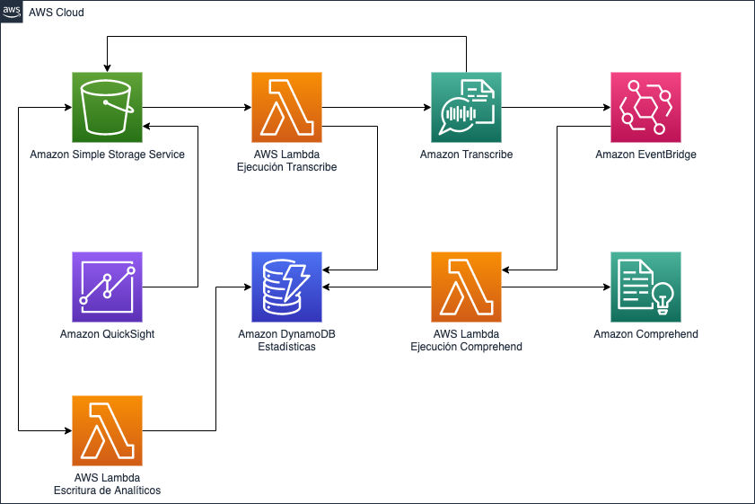

# Amazon Transcribe and Comprehend using event sourcing

In this demo we are going to create a process pipeline to transcribe audio files and later on process sentiment analysis over the transcriptions.
This demo uses the "Event Sourcing" pattern to provide a scalable and cost-efficient solution.
The language for processing is spanish by default, you can change it in the SAM template.

#### Template parameters:
- ProcessBucketName - Name of the bucket to use for media and text storage.
- ProcessTableName - Name of the DynamoDB table used to store the process status and outcome.
- ComprehendLanguageCode - The language code for Amazon Comprehend, one of these https://docs.aws.amazon.com/comprehend/latest/dg/supported-languages.html[languages].
- TranscribeLanguageCode - The language code for Amazon Transcribe, one of these https://docs.aws.amazon.com/transcribe/latest/dg/what-is-transcribe.html[languages].

### Prerequisites:
- AWS Account
- SAM CLI - https://docs.aws.amazon.com/serverless-application-model/latest/developerguide/serverless-sam-cli-install.html[Install Guide]
- IAM User with access keys and Adminitrator privileges.

### Services used:
- https://aws.amazon.com/s3[Amazon Simple Storage Service]
- https://aws.amazon.com/lambda[AWS Lambda]
- https://aws.amazon.com/dynamodb[Amazon DynamoDB]
- https://aws.amazon.com/eventbridge[Amazon EventBridge]
- https://aws.amazon.com/comprehend[Amazon Comprehend]
- https://aws.amazon.com/s3[Amazon Transcribe]
- https://aws.amazon.com/s3[Amazon Quicksight]

### Architecture:



### Build

```
sam build
```

### Deployment
```
sam package --output-template-file package.yaml --s3-bucket [ARTIFACTS_BUCKET_NAME] --s3-prefix transcribe-sentiment
sam deploy --template-file package.yaml --stack-name transcribe-sentiment --capabilities CAPABILITY_IAM
```

Where ARTIFACTS_BUCKET_NAME is an S3 bucket name used to upload the artifacts for deployment.

## Security

See [CONTRIBUTING](CONTRIBUTING.md#security-issue-notifications) for more information.

## License

This library is licensed under the MIT-0 License. See the LICENSE file.
